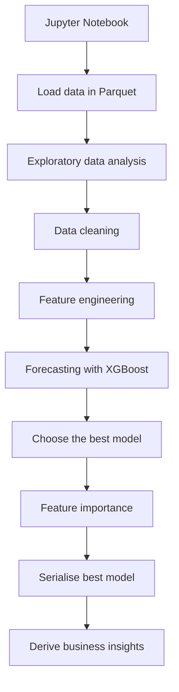

# About this project
This project showcases time-series demand forecasting using a gradient boosting machine learning algorithm (XGBoost). Demand forecasting is crucial for resource allocation analytics, pricing, and revenue optimisation.

The dataset used for this project is taken from the 2023-2024 data of the NYC yellow taxi data (https://www.nyc.gov/site/tlc/about/tlc-trip-record-data.page).

## Executive summary
This project tackles demand forecasting for the NYC yellow taxis. In this project, I demonstrate how a simple machine learning operations (MLOps) pipeline can help us generate valuable insights and help stakeholders make effective and responsible business decisions. 

## Build status
[](https://github.com/EMarc2023/Forecasting_with_GBM/actions/workflows/ci_cd.yml)


## Frontend UI
The frontend UI is available on https://emarc2023-forecasting-with-gbm-app-xqdmln.streamlit.app/

Detailed information on the frontend UI is provided below under the subsection "Running the prediction script (via Streamlit UI - see screenshot)".

## Solution design
### For the Jupyter notebook:


### For `predict.py`
This script will load the best-performing model and lets users forecast taxi demand by providing a date and hour (see "How to run the notebook and prediction" for details).

## How to run the notebook and prediction 

### Step 1
Clone this repository.

### Step 2
Install the required Python packages (listed in `requirements.txt`) if necessary. Here are the steps:
```
bash
python3 -m venv venv
source venv/bin/activate
pip install -r requirements.txt
```

### Step 3
### Running the notebook
To run the notebook, open "Forecasting-NYC-yellow-taxi.ipynb" on a Jupyter interface and run all cells.

### Running the prediction script (via Streamlit UI - see screenshot)
Note: A screenshot of the Streamlit UI is available in the ```screenshot``` folder of this repository. 

To run the prediction via the Streamlit UI, first execute the following:
```
bash
streamlit run app.py
```

The Streamlit UI will then load on the browser. Then, enter the date and time for prediction (without quotation marks), and the predicted number will be shown.

For example, entering 
```
2025-05-11 19:00:00
```
will output
```
Predicted trip volume (taxi demand) is: 5134.99
```

### Running the prediction script (100% via CLI)
To run `predict.py`, execute the following:
```
bash
python3 predict.py "YYYY-MM-DD HH:00:00"
```

Example:
Running
```
bash
python3 predict.py "2025-05-11 19:00:00"
```
will output
```
Predicted trip volume (taxi demand) is: 5134.99
```

## Business insights:
1. Time-series data, such as illustrated by the NYC taxi data, follows strong multi-seasonal trends. In the case of the NYC yellow taxi data, the seasonalities are daily, monthly, and yearly.

2. Understanding these seasonalities is crucial for businesses to optimise resource allocation and implement dynamic pricing strategies to maximise revenue during high-demand periods.

3. Feature importance helps businesses identify the strongest features that contribute to the observed data (e.g., in this case study, the taxi demand).

4. By including seasonality (via lag terms), we can build a higher-performing ML model for forecasting. As demonstrated in the Jupyter notebook, including the lag terms reduces the root mean square error (RMSE) by around 10% compared to the baseline model.

5. Well-practised data science and MLOps are valuable tools to enhance business outcomes.

## Limitation on the predictions
This solution is best suited for short-term time-forecasting (with 1 a year time horizon), as the ML model was trained on a 2 year data with lag features of (1 day, 1 week, and 1 year - following the seasonalities).

## Production (MLOps) considerations and further developments
While I have provided a simple unit test (`tests/test_predict.py`) and a simple CI/CD pipeline (for now), to turn this exercise for full-blown production workloads, I would:
1. Further refine the models by performing a more detailed hyperparameter search and explore more interaction terms (such as combining weather and the day of the week and/or holiday season and geographic area).
2. Add automated ML model retraining as new data arrives, and a data drift monitoring feature. The data drift monitoring will help both the data scientists and stakeholders, ensuring that the model adapts to seasonal trends or fluctuating taxi demand.
3. Consider using scalable data handling (e.g., Dask, Spark for data wrangling, Airflow for data orchestration) if the data volume warrants it.
4. Turn the prediction script into a backend API (using FastAPI/Flask) and then add a frontend (TypeScript/React) for better modularity and scalability.
